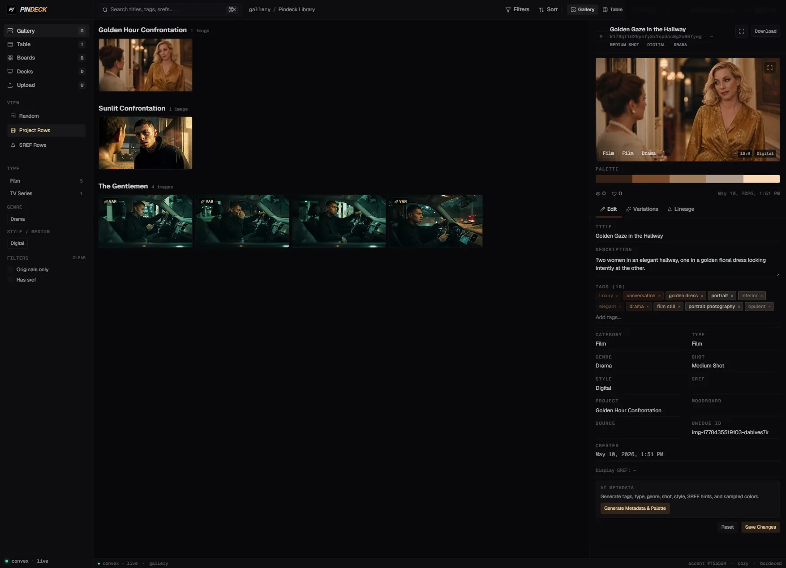

# Pindeck



AI-powered image gallery + generation app using React, Convex, OpenRouter, and fal.ai.

## Production Names

Pindeck has one production frontend and one production backend target:

| Surface | Production name | Target |
| --- | --- | --- |
| Frontend | Vercel project `pindeck` | `https://pindeck.dev` |
| Backend | Self-hosted Convex | `https://convex.serving.cloud` |
| HTTP actions | Self-hosted Convex site | `https://convex-site.serving.cloud` |

Use `production` only for the Vercel deployment target. Do not create or select
Convex Cloud deployments named `production`, `production-pindeck`, or similar for
this app; Pindeck production deploys to self-hosted Convex through
`CONVEX_SELF_HOSTED_URL` and `CONVEX_SELF_HOSTED_ADMIN_KEY`.

The old duplicate Vercel test project `pindeck-754f` was removed on June 15,
2026. The only current frontend production project is `pindeck`.

## Local Production Workflow

This repo is configured to run locally against the self-hosted Pindeck Convex
production backend.

1. Install dependencies:
```bash
bun install
```

2. Configure env:
```bash
cp .env.example .env
```

3. Set self-hosted production Convex URLs in `.env`:
```bash
VITE_CONVEX_URL=https://convex.serving.cloud
VITE_CONVEX_SITE_URL=https://convex-site.serving.cloud
```

4. Build production bundle:
```bash
bun run build
```

5. Serve production bundle:
```bash
bun run serve
```

`bun run serve` always uses port `4173` and will kill any process already using that port before starting.

## Current Production Deployments

- Convex production deployment: **self-hosted only**
- Convex client URL: `https://convex.serving.cloud`
- Convex HTTP/actions URL: `https://convex-site.serving.cloud`
- Frontend production project: **Vercel `pindeck`**
- Frontend production URL: `https://pindeck.dev`
- Frontend production aliases: `https://www.pindeck.dev`, `https://pindeck-git-main-gordo-v1su4s-projects.vercel.app`, `https://pindeck-gordo-v1su4s-projects.vercel.app`
- Legacy Convex Cloud deployments have been removed/deleted and must not be used for deploys or frontend env.
- Discord bot + media gateway deployment source: separate repo `~/Documents/Github/discord-bot`

## Required Environment Variables

### Convex Dashboard (Backend)

Set in Convex Project Settings:
- `JWT_PRIVATE_KEY`
- `OPENROUTER_API_KEY`
- `OPENROUTER_VLM_MODEL` (optional)
- `OPENROUTER_PROVIDER_SORT` (optional)
- `FAL_KEY`
- `INGEST_API_KEY` (for Discord ingest)
- `ADMIN_USER_IDS` / `ADMIN_EMAILS` (optional comma-separated admin overrides for image delete/edit)
- `DISCORD_STATUS_WEBHOOK_URL` (optional Discord status updates)
- `MEDIA_GATEWAY_URL=https://media.v1su4.dev`
- `MEDIA_GATEWAY_TOKEN`
- `MEDIA_GATEWAY_BUCKET=pindeck`
- `MEDIA_GATEWAY_USER_ID=pindeck`
- `MEDIA_GATEWAY_UPLOAD_PREFIX=media-uploads`
- `PINDECK_STORAGE_PROVIDER=rustfs`
- `AUTH_GOOGLE_ID` / `AUTH_GOOGLE_SECRET` (optional; Google OAuth — backend-only until env + UI are enabled)
- `AUTH_GITHUB_ID` / `AUTH_GITHUB_SECRET` (optional; GitHub OAuth — backend-only until env + UI are enabled)
- `SITE_URL` (public app URL for OAuth redirect/callback; required if OAuth env is set)

### Local / Vercel Frontend

Set for frontend build/runtime:
- `VITE_CONVEX_URL=https://convex.serving.cloud`
- `VITE_CONVEX_SITE_URL=https://convex-site.serving.cloud`

For Convex function deploys:
- `CONVEX_SELF_HOSTED_URL=https://convex.serving.cloud`
- `PINDECK_CONVEX_SELF_HOSTED_ADMIN_KEY=<Pindeck self-hosted admin key>`
- `CONVEX_SELF_HOSTED_ADMIN_KEY=<self-hosted admin key>` is also accepted by the Convex CLI, but prefer the Pindeck-prefixed name in Bitwarden so it cannot be confused with Review Room / Unfold.
- Do **not** set `CONVEX_DEPLOYMENT` for Pindeck production.

Vercel production builds deploy Convex when `CONVEX_SELF_HOSTED_URL` and `CONVEX_SELF_HOSTED_ADMIN_KEY` are configured. Preview builds without those deploy secrets run as frontend-only builds, so PR checks can still validate the UI without backend deploy credentials.

## Scripts

- `bun run check:prod-target` - Verify local env is pinned to self-hosted production Convex
- `bun run build` - Local production frontend build (`vite build`); on Vercel production builds with deploy secrets, this deploys Convex first, then builds the frontend.
- `bun run serve` - Production preview on `4173` (auto-kills existing `4173` listener first)
- `bun run deploy:convex` - Deploy Convex functions with `bunx convex deploy`

## Media Upload Pipeline (Convex -> RustFS)

- Uploads first land in Convex storage, then `convex/mediaStorage.finalizeUploadedImage` persists to the RustFS media API.
- Durable assets live in the `pindeck` bucket and read publicly from `https://s3.v1su4.dev/pindeck/...`.
- RustFS object key format is:
  - `media-uploads/YYYY/MM_DD/original/<file>`
  - `media-uploads/YYYY/MM_DD/preview/<file>-preview.<ext>`
  - `media-uploads/YYYY/MM_DD/low/<file>-w320.<ext>`
  - `media-uploads/YYYY/MM_DD/high/<file>-w1280.<ext>` / `w1920.<ext>`
- Convex and Vercel never receive direct S3 credentials; all writes and deletes go through `MEDIA_GATEWAY_URL`.

### Image record tracking fields

Each image now carries persistence status for observability:
- `storageProvider`: `convex` | `rustfs`
- `storageBucket`: bucket name for RustFS-backed assets
- `storagePersistStatus`: `pending` | `succeeded` | `failed`
- `storagePersistError`: generic storage error when persist failed
- `derivativeUrls`: `{ small, medium, large }` (when available)
- `derivativeStoragePaths`: `{ small, medium, large }` (when available)

Gallery, boards, deck, and table all continue to read the same `images.imageUrl` / `previewUrl` fields; those URLs should resolve to RustFS-backed public objects.

## Discord Bot (Ingest + Status)

The Discord bot and media gateway are hosted/deployed from a separate repo:

- Source of truth: `~/Documents/Github/discord-bot`
- This `pindeck` repo consumes those services via:
  - Convex HTTP actions (`/ingestExternal`, `/discordQueue`, `/discordModerate`)
  - Media gateway endpoint/env wiring (`MEDIA_GATEWAY_URL`, token-based auth)

Typical setup in `.env`:
- `DISCORD_TOKEN`
- `DISCORD_CLIENT_ID`
- `DISCORD_GUILD_ID`
- `DISCORD_INGEST_EMOJIS` (example: `:pushpin:` equivalent unicode/custom emoji format)
- `INGEST_API_KEY`
- `MEDIA_GATEWAY_URL` / `RUSTFS_MEDIA_API_URL` (RustFS-backed media API)
- `MEDIA_GATEWAY_TOKEN` / `MEDIA_API_TOKEN`
- `MEDIA_GATEWAY_BUCKET=pindeck`
- `PINDECK_INGEST_URL` (optional if deriving from Convex site URL)
- `PINDECK_DISCORD_QUEUE_URL` / `PINDECK_DISCORD_MODERATION_URL` (optional overrides)

Run:
```bash
# Run from the separate discord-bot repository:
cd ~/Documents/Github/discord-bot
bun install
bun run dev
```

### Discord Bot Deployment

Notes:
- Manage the Discord bot and media gateway from the separate `discord-bot` repo.
- Keep hostnames, IP addresses, usernames, and SSH targets out of this repository.
- Pushing to `main` in the separate `discord-bot` repo can trigger its deploy workflow when the required GitHub Actions secrets are configured.

## Deploy

### Convex

```bash
bun run deploy:convex
```

This requires `.env` or the shell environment to include:

```bash
CONVEX_SELF_HOSTED_URL=https://convex.serving.cloud
PINDECK_CONVEX_SELF_HOSTED_ADMIN_KEY=...
```

Do **not** set `CONVEX_DEPLOYMENT`; the old Convex Cloud project has been deleted and Pindeck production uses the self-hosted Convex target above.
No Convex MCP is configured or required for production deploys; use the direct self-hosted Convex CLI target above.

For self-hosted Convex health checks, Hostinger VPS container logs, and safe
agent access commands, see [`docs/self-hosted-convex-ops.md`](docs/self-hosted-convex-ops.md).

### Vercel

Use the active Vercel project named **`pindeck`** for production deployment. Pushing to `main` on GitHub triggers the Vercel production deploy at `https://pindeck.dev`; Vercel runs `bun run build`, and `scripts/build.sh` runs `bunx convex deploy --cmd 'bun run build:frontend'` on production builds when the self-hosted Convex deploy secrets are present. Preview builds without those secrets skip Convex deploy and run the frontend build only.

**Vercel builds** do not use `.env`. The check script and **`vite.config.ts`** **default** `VITE_CONVEX_URL` to **`https://convex.serving.cloud`** when unset, so previews deploy without extra env. Set `VITE_CONVEX_SITE_URL=https://convex-site.serving.cloud` when code needs the HTTP/actions URL.

Locally, keep **`VITE_CONVEX_URL`**, **`VITE_CONVEX_SITE_URL`**, **`CONVEX_SELF_HOSTED_URL`**, and **`PINDECK_CONVEX_SELF_HOSTED_ADMIN_KEY`** in **`.env`** so `dev` / `deploy:convex` match production (see `.env.example`). Keep **`CONVEX_DEPLOYMENT` unset**.

## Unified UI / design tokens (Tweaks)

- Tweaks persisted in `localStorage` (`pindeck_tweaks`) drive **`applyPindeckTweaksToDocument`** in [`src/lib/pdTheme.ts`](src/lib/pdTheme.ts): `--pd-accent`, derived `--pd-accent-ink`, `--pd-accent-soft`, `--pd-accent-hover`, `--pd-accent-contrast-text`, plus TMP-compatible `--accent*` aliases on `document.documentElement`.
- The static prototype reference lives under [`TMP/`](TMP/) (see [`TMP/HANDOFF.md`](TMP/HANDOFF.md)); larger deck deltas vs [`claude/redesign`](branch) are summarized in [`docs/guides/redesign-deck-port-inventory.md`](docs/guides/redesign-deck-port-inventory.md).
- Sign-in ([`src/SignInForm.tsx`](src/SignInForm.tsx)) supports **email/password** and **guest**; Google/GitHub OAuth providers remain in [`convex/auth.ts`](convex/auth.ts) but are hidden until OAuth env is configured. Sign-in uses the same CSS variables so primary actions match the Tweaks accent (aligned with [`claude/redesign`](branch) semantics).

**Gotcha:** Do not re-declare `--pd-accent`, `--pd-accent-ink`, `--pd-accent-soft`, `--pd-font-*`, etc. on `.pd-theme` — they would override `document.documentElement` and break Tweaks until you move those variables to `:root` defaults only (see [`src/index.css`](src/index.css)).

## Notes

- **Deck composer** ([`src/components/deck/DeckComposer.tsx`](src/components/deck/DeckComposer.tsx)): edits autosave to Convex via **`decks.update`** (debounced ~800ms) with a **Saving… / Saved** indicator; legacy full-state `localStorage` is migrated on first Convex save. Only UI selection index stays in `localStorage`.
- **Image permissions**: delete and metadata edit require ownership (or admin via **`ADMIN_USER_IDS`** / **`ADMIN_EMAILS`** in Convex env). Table bulk delete surfaces skipped rows when permission is denied.
- **pd Gallery tiles** ([`src/components/pd/GalleryView.tsx`](src/components/pd/GalleryView.tsx)): image-first cards with a **VAR** badge for generated children; **heart** + **bookmark** are **top-right only** (no second like indicator). Like uses optimistic UI; filled **red** heart / **blue** filled bookmark when the image is on a board. Variation generation stays in the image drawer, not on the tile overlay.
- **Create New Board** (bookmark → Create board, [`src/components/CreateBoardModal.tsx`](src/components/CreateBoardModal.tsx)): **`Dialog`** with **`.pd-theme`** + same field chrome as the image drawer (`var(--pd-line-strong)`, `--pd-accent` primary); **`boards.create`** args remain **name**, **description**, **isPublic**. Image **variation** generation stays on **`vision.generateVariations`** in the drawer (`ImageDetailDrawer`), not this modal.
- **Decks** ([`src/components/DeckView.tsx`](src/components/DeckView.tsx), [`src/components/deck/`](src/components/deck/)): Matches **`claude/redesign`** — sideways deck library strip, **`DeckComposer`** + **`DeckCanvasPage`**. Composer state **autosaves to Convex** via **`decks.update`** (blocks, palette, slides, FX, typography). **`convex/decks.list`** returns **`stripImageUrls`** + **`stripPalettes`** (**`images.colors[..5]`** per slide, same metadata as the **Table** `PinSwatches` column). Library cards use a **16:9 hero** still for the first slide and a **filmstrip** row for extras, each with **`PinSwatches`**. **Tweaks** **`--pd-accent*`** apply to **composer chrome**; composer **left swatches** client-sample the **active** strip image (Convex fallback by **`imageUrl`**). **`DeckCanvasPage`** slide frames have **no selection outline**; **editable-text** focus uses **`colors.accent`**. Deploy self-hosted Convex after **`decks.list`** / **`decks.update`** changes.
- **Image palette / swatches:** Stored `colors` are **average RGB per quantized cluster** (not lattice corners), Lab-space dedup + warm-scene magenta/purple suppression (`src/lib/colorPaletteCore.ts`). Server prefers **`imageUrl`** (`convex/colorExtractionUrls.ts`). After changing extraction logic deploy self-hosted Convex, then Table **“Refresh metadata”** / **“Refresh selected”** → wait for scheduled actions → reload.
- **Cinematic metadata (TYPE / Genre / Shot / Style):** VLM analysis (`convex/vision.ts`) writes `group`, `genre`, `shot`, and `style` on `images`. Table **“Refresh metadata”** schedules metadata and color refresh for **your** uploads; when rows are selected, **“Refresh selected”** only schedules the selected images. Sidebar filter chips use `libraryAggregations` + shared client filters (`src/lib/libraryFilters.ts`).
- Do not use `bunx convex dev` when targeting production.
- Vercel does not host the Discord websocket worker; run bot separately (always-on worker/container).
- Do not treat `services/discord-bot` in this repo as deployment source; use `~/Documents/Github/discord-bot`.
- Pinterest/FreshRSS automation runs from the standalone Discord worker repo at `discord-bot/services/pinterest-ingest`. It uses `gallery-dl` plus exported cookies to discover Pinterest images, exposes RSS feeds for FreshRSS, and sends new items to this app's `/ingestExternal` endpoint so Pindeck copies the files into RustFS before review.
- `dev`, `build`, `serve`, `lint`, and `deploy:convex` enforce self-hosted production Convex targets (`https://convex.serving.cloud`) and fail fast otherwise.
