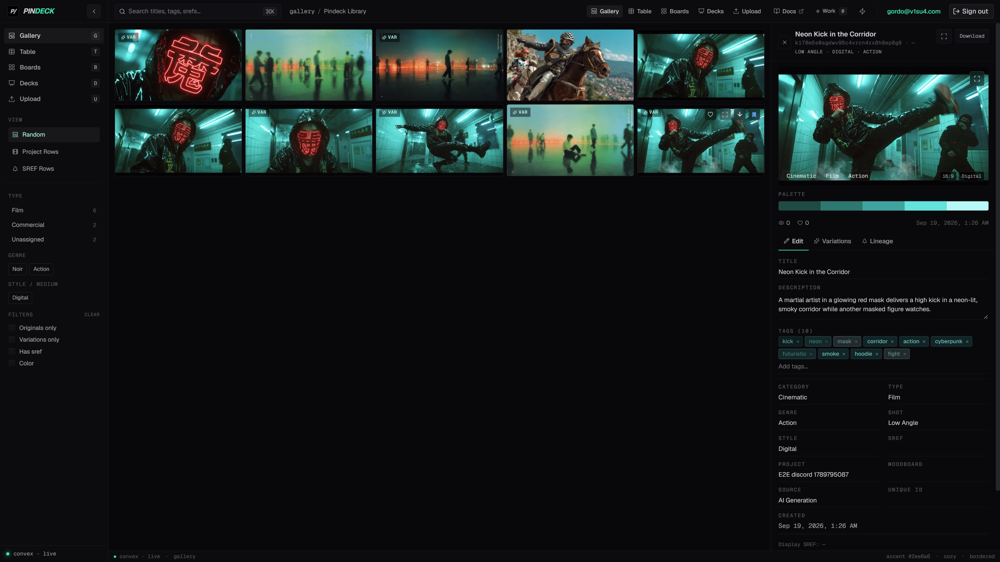
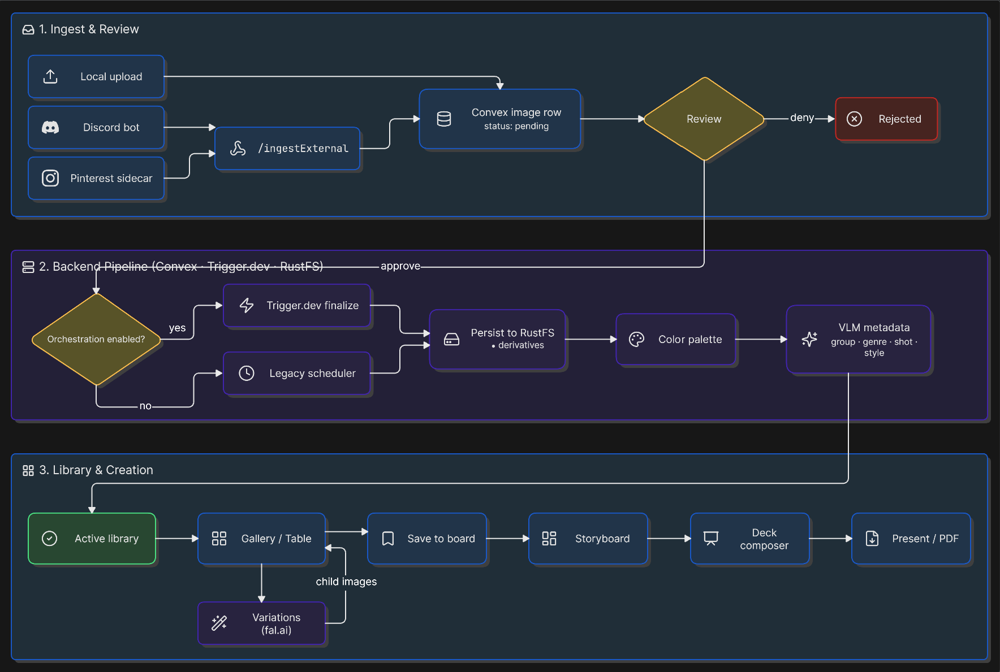

# Pindeck

Pindeck is one workspace for curating images so you are not saving Midjourney outputs to disk, uploading them elsewhere, and rebuilding versions in other tools. Live at [pindeck.dev](https://pindeck.dev).

## Stack

- React + TypeScript (Vite) on Vercel
- Self-hosted Convex (realtime data, auth, HTTP actions)
- Self-hosted Trigger.dev (upload finalize, ingest, analysis, variation jobs)
- RustFS object storage for durable media
- OpenRouter-compatible vision for metadata; fal.ai Nano Banana Pro edit for variations

## What it does

- **Discord ingest:** react with configured emoji on a channel image; the bot POSTs to Pindeck and items queue for approve/deny (typical Midjourney workflow)
- **Manual upload:** Upload → Local; selected files upload through Convex and the same finalize, metadata, and palette pipeline as imports
- **Pinterest ingest:** Upload → Pinterest; save a board, profile, or pin URL, then **Run + Send** (or **Run** then **Send to Queue**) to extract pins and forward new images into Pindeck; the ingest worker also supports scheduled board polling
- **Pinterest review:** Pinterest imports stay pending until you approve them in Upload
- **Auto meta tagging:** after upload finalize or import approve, smart analysis writes group/type, genre, shot, style, tags, and dominant colors
- **Sref tracking:** Discord ingest extracts sref from message text; sref is stored on the image, shown in table/drawer, searchable in the top bar, filterable (originals / sref), and passed into variation prompts; generated children inherit parent/root sref
- **Organize:** gallery and table views, sidebar filters, palette swatches, and boards to save images
- **Variations:** pick a mode and count in the image drawer; fal.ai edits create child images with `parentImageId` lineage
- **Storyboards:** on a board, use the storyboard builder to arrange board images into grid, hero, or strip panels and save layouts to Convex
- **Pitch decks:** deck library plus composer with autosave to Convex, built from curated image strips

## Production layout

Public app: [pindeck.dev](https://pindeck.dev). Backend layers (Convex, Trigger, media gateway, Pinterest sidecar) are **self-hosted**; their URLs live in **`.env.local`** (git-ignored), not in this repo. Flow diagrams: **[docs/architecture/platform-topology.md](docs/architecture/platform-topology.md)**. Glossary: **[CONTEXT.md](CONTEXT.md)**.

| Surface      | Role |
| ------------ | ---- |
| Frontend     | Vercel project `pindeck` → [pindeck.dev](https://pindeck.dev) |
| Backend      | Self-hosted Convex |
| HTTP actions | Self-hosted Convex HTTP actions |

Deploy patterns: **[platform-topology](docs/architecture/platform-topology.md)** and **[self-hosted-convex-ops](docs/self-hosted-convex-ops.md)**.

## Development

For local setup, environment configuration, and deployment, see [Developer setup](docs/developer-setup.md).

## Scripts

- `bun run check:prod-target` - Verify local env is pinned to self-hosted production Convex
- `bun run build` - Local production frontend build (`vite build`); on Vercel production builds with deploy secrets, the Bun-native `scripts/build.ts` wrapper deploys Convex first, then builds the frontend.
- `bun run serve` - Production preview on `4173` (auto-kills existing `4173` listener first)
- `bun run deploy:convex` - Deploy Convex functions with `bunx convex deploy`
- `bun run trigger:dev` - Run Pindeck Trigger tasks against your configured Trigger control plane
- `bun run trigger:deploy` - Deploy Trigger tasks (run on the Linux worker host; see `docs/trigger-orchestration.md`)
- `bun run e2e:smoke` - HTTP smoke for ingest and orchestration
- `bun run e2e:ui` - Playwright app smoke using the configured test environment

## Trigger.dev Orchestration

Long-running Pindeck work runs in its own project on the shared self-hosted
Trigger.dev control plane. Upload finalization, external ingest, media repair,
image refresh, and variation generation expose structured stages and timing.
Variation generation uses a parent plus one serialized FAL child task per
render. The authenticated Work Activity pop-down subscribes to the current
user's scoped Trigger tag for realtime progress without exposing project
credentials to the browser.

See [Trigger.dev orchestration](docs/trigger-orchestration.md) for the queue,
secret, callback, rollout, and verification contract.

## Overall Workflow

## Media Upload Pipeline (Convex -> RustFS)

- Uploads first land in Convex storage, then `convex/mediaStorage.finalizeUploadedImage` persists to the RustFS media API.
- Durable assets live in the configured bucket and are served via your media gateway public URL prefix.
- RustFS object key format is:
  - `media-uploads/YYYY/MM_DD/original/<file>`
  - `media-uploads/YYYY/MM_DD/preview/<file>-preview.<ext>`
  - `media-uploads/YYYY/MM_DD/low/<file>-w320.<ext>`
  - `media-uploads/YYYY/MM_DD/high/<file>-w1280.<ext>` / `w1920.<ext>`
- Convex and Vercel never receive direct S3 credentials; all writes and deletes go through the media gateway.

### Image record tracking fields

Each image now carries persistence status for observability:

- `storageProvider`: `convex` | `rustfs`
- `storageBucket`: bucket name for RustFS-backed assets
- `storagePersistStatus`: `pending` | `succeeded` | `failed`
- `storagePersistError`: generic storage error when persist failed
- `derivativeUrls`: `{ small, medium, large }` (when available)
- `derivativeStoragePaths`: `{ small, medium, large }` (when available)

Gallery, boards, deck, and table all continue to read the same `images.imageUrl` / `previewUrl` fields; those URLs should resolve to RustFS-backed public objects.

## Discord integration

Discord ingest and the media gateway run from the separate `discord-bot` repository. See [Developer setup](docs/developer-setup.md#discord-bot-ingest--status) for configuration and deployment notes.

## Unified UI / design tokens (Tweaks)

- Tweaks persisted in `localStorage` (`pindeck_tweaks`) drive **`applyPindeckTweaksToDocument`** in [`src/lib/pdTheme.ts`](src/lib/pdTheme.ts): `--pd-accent`, derived `--pd-accent-ink`, `--pd-accent-soft`, `--pd-accent-hover`, `--pd-accent-contrast-text`, plus TMP-compatible `--accent*` aliases on `document.documentElement`.
- The static prototype reference lives under [`TMP/`](TMP/) (see [`TMP/HANDOFF.md`](TMP/HANDOFF.md)). Production UI reference: [pindeck.dev](https://pindeck.dev).
- Sign-in ([`src/SignInForm.tsx`](src/SignInForm.tsx)) supports **email/password** and **guest**; Google/GitHub OAuth providers remain in [`convex/auth.ts`](convex/auth.ts) but are hidden until OAuth env is configured. Sign-in uses the same CSS variables so primary actions match the Tweaks accent (aligned with [`claude/redesign`](branch) semantics).

**Gotcha:** Do not re-declare `--pd-accent`, `--pd-accent-ink`, `--pd-accent-soft`, `--pd-font-*`, etc. on `.pd-theme` — they would override `document.documentElement` and break Tweaks until you move those variables to `:root` defaults only (see [`src/index.css`](src/index.css)).

## Library UI

Production gallery and table are the pd-theme views:

- **Gallery:** [`src/components/pd/GalleryView.tsx`](src/components/pd/GalleryView.tsx)
- **Table:** [`src/components/pd/TableView.tsx`](src/components/pd/TableView.tsx) — custom table (not TanStack Table)
- **Image details / variations / lineage:** [`src/components/pd/ImageDetailDrawer.tsx`](src/components/pd/ImageDetailDrawer.tsx)
- **App chrome:** [`src/components/shell/`](src/components/shell/) (Topbar, Sidebar, view / filter / column hooks)

Unused Radix `ImageGrid`, `TableView`, `ImageModal`, `EditImageModal`, `GenerateVariationsModal`, and `CategoryFilter` were removed (V1S-85), along with `@dnd-kit/*` and `@tanstack/react-table`. Architecture notes live in [`.cursor/rules/project-structure.mdc`](.cursor/rules/project-structure.mdc) and [`.cursor/rules/tech-stack.mdc`](.cursor/rules/tech-stack.mdc). This repo does not use `WARP.md`.

## Notes

- **Deck composer** ([`src/components/deck/DeckComposer.tsx`](src/components/deck/DeckComposer.tsx)): edits autosave to Convex via **`decks.update`** (debounced ~800ms) with a **Saving… / Saved** indicator; legacy full-state `localStorage` is migrated on first Convex save. Only UI selection index stays in `localStorage`.
- **Image permissions**: delete and metadata edit require ownership (or configured administrator access). Table bulk delete surfaces skipped rows when permission is denied.
- **pd Gallery tiles** ([`src/components/pd/GalleryView.tsx`](src/components/pd/GalleryView.tsx)): image-first cards with a **VAR** badge for generated children; **heart** + **bookmark** are **top-right only** (no second like indicator). Like uses optimistic UI; filled **red** heart / **blue** filled bookmark when the image is on a board. Variation generation stays in the image drawer, not on the tile overlay.
- **Create New Board** (bookmark → Create board, [`src/components/CreateBoardModal.tsx`](src/components/CreateBoardModal.tsx)): **`Dialog`** with **`.pd-theme`** + same field chrome as the image drawer (`var(--pd-line-strong)`, `--pd-accent` primary); **`boards.create`** args remain **name**, **description**, **isPublic**. Image **variation** generation stays on **`vision.generateVariations`** in the drawer (`ImageDetailDrawer`), not this modal.
- **Decks** ([`src/components/DeckView.tsx`](src/components/DeckView.tsx), [`src/components/deck/`](src/components/deck/)): Matches **`claude/redesign`** — sideways deck library strip, **`DeckComposer`** + **`DeckCanvasPage`**. Composer state **autosaves to Convex** via **`decks.update`** (blocks, palette, slides, FX, typography). **`convex/decks.list`** returns **`stripImageUrls`** + **`stripPalettes`** (**`images.colors[..5]`** per slide, same metadata as the **Table** `PinSwatches` column). Library cards use a **16:9 hero** still for the first slide and a **filmstrip** row for extras, each with **`PinSwatches`**. **Tweaks** **`--pd-accent*`** apply to **composer chrome**; composer **left swatches** client-sample the **active** strip image (Convex fallback by **`imageUrl`**). **`DeckCanvasPage`** slide frames have **no selection outline**; **editable-text** focus uses **`colors.accent`**. Deploy self-hosted Convex after **`decks.list`** / **`decks.update`** changes.
- **Image palette / swatches:** Stored `colors` are **average RGB per quantized cluster** (not lattice corners), Lab-space dedup + warm-scene magenta/purple suppression (`src/lib/colorPaletteCore.ts`). Server prefers **`imageUrl`** (`convex/colorExtractionUrls.ts`). After changing extraction logic deploy self-hosted Convex, then Table **“Refresh metadata”** / **“Refresh selected”** → wait for scheduled actions → reload.
- **Cinematic metadata (TYPE / Genre / Shot / Style):** VLM analysis (`convex/vision.ts`) writes `group`, `genre`, `shot`, and `style` on `images`. Table **“Refresh metadata”** schedules metadata and color refresh for **your** uploads; when rows are selected, **“Refresh selected”** only schedules the selected images. Sidebar filter chips use `libraryAggregations` + shared client filters (`src/lib/libraryFilters.ts`).
- **Images Convex module:** Public `api.images.*` (wire path `images:*`) is re-exported from root [`convex/images.ts`](convex/images.ts) and [`convex/images/index.ts`](convex/images/index.ts). Domain logic lives in `library`, `ingest`, `moderation`, `lifecycle`, `uploads`, `analysis`, `generation`, and `shared` under [`convex/images/`](convex/images/). HTTP routes still import handlers from `./images`. Trigger orchestration lease/status writes live in [`convex/orchestrationState.ts`](convex/orchestrationState.ts); storage path helpers live in [`convex/lib/mediaAdapter.ts`](convex/lib/mediaAdapter.ts) (re-exported from [`convex/mediaAdapter.ts`](convex/mediaAdapter.ts)).
- Do not use `bunx convex dev` when targeting production.
- Vercel does not host the Discord websocket worker; run bot separately (always-on worker/container).
- Do not treat `services/discord-bot` in this repo as deployment source; use the separate discord-bot repo.
- Pinterest/FreshRSS automation runs from the standalone Discord worker repo at `discord-bot/services/pinterest-ingest`. It uses `gallery-dl` plus exported cookies to discover Pinterest images, exposes RSS feeds for FreshRSS, and sends new items to this app's `/ingestExternal` endpoint so Pindeck copies the files into RustFS before review.
- **Docs (Mintlify):** [docs.pindeck.dev](https://docs.pindeck.dev) from repo `docs/` — `docs.json` loads `style.css` + `accent.js` (dark Pindeck chrome; **Docs** top bar passes `?accent=` from Tweaks). Start at **Product workflow** and **Architecture overview** (mermaid: ingest → RustFS → tag/display, board-before-deck).
- `dev`, `build`, `serve`, `lint`, and `deploy:convex` can enforce the configured production Convex target via `scripts/enforce-production-convex.sh`.
