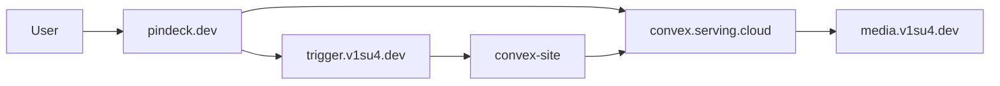
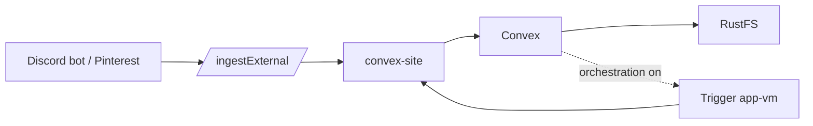

# Pindeck platform topology

Canonical map of **where Pindeck runs** and **how traffic flows**. Convex SSH/container detail: [`docs/self-hosted-convex-ops.md`](../self-hosted-convex-ops.md). Trigger callbacks: [`docs/trigger-orchestration.md`](../trigger-orchestration.md). Homelab: `proxmox-home/docs/pindeck-platform-topology.md`. Obsidian: `hermes-notebook-vault/04-Projects/Pindeck/`.

## Production surfaces

| Layer | Host | URL / access |
| ----- | ---- | ------------ |
| Frontend | Vercel project **`pindeck`** | [pindeck.dev](https://pindeck.dev) |
| Convex API | Hostinger **`serving`**, Docker **`pindeck-convex`** | `https://convex.serving.cloud` |
| HTTP actions | Same stack (ingest, Discord, orchestration) | `https://convex-site.serving.cloud` |
| Dashboard | Same stack | `https://convex-dashboard.serving.cloud` |
| Background jobs | Proxmox **VM100 `app-vm`** | `https://trigger.v1su4.dev` · deploy **`/opt/pindeck`** as **gordo** |
| Object storage | VM114 **`rustfs-storage`** | `https://media.v1su4.dev` (bucket **`pindeck`**) |
| Discord bot | Separate **`discord-bot`** process | → `convex-site` with `INGEST_API_KEY` |
| Pinterest | RSSBridge on **`serving`** | `https://rssbridge.serving.cloud/pinterest-ingest` → ingest |

**Not Pindeck:** Review Room uses **`unfold*.serving.cloud`** (same VPS, different Compose project).

## Flows

### Browser



### External ingest



## Deploy after merge

1. **Convex** — workstation: `bun run deploy:convex`
2. **Trigger** — app-vm: `git pull` in `/opt/pindeck`, `bun run trigger:deploy` as **gordo**
3. **Frontend** — push **`main`** → Vercel **`pindeck`**

## Verify

| Check | How |
| ----- | --- |
| Convex | `./scripts/check-pindeck-convex.sh` |
| HTTP ingest | `./scripts/e2e-production-smoke.sh` |
| UI | [pindeck.dev](https://pindeck.dev) or `bun run e2e:ui` |
| Trigger | `curl -fsS https://trigger.v1su4.dev/healthcheck` |

## Repo layout

```text
src/           React (Vercel)
convex/        Backend (serving)
src/trigger/   Trigger tasks (built on app-vm)
services/discord-bot/   Reference; prod bot often in discord-bot repo
```
