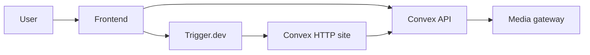
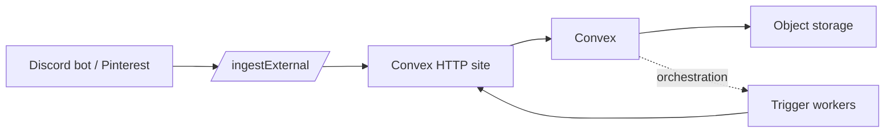

# Pindeck platform topology

Map of **roles** and **traffic flow**. Convex ops patterns: [`docs/self-hosted-convex-ops.md`](../self-hosted-convex-ops.md). Trigger: [`docs/trigger-orchestration.md`](../trigger-orchestration.md). **URLs** for each layer live in environment variables (`.env.local`, Vercel/Convex dashboard secrets), not in this repo.

## Production surfaces

| Layer | Role |
| ----- | ---- |
| Frontend | Static/hosted web app ([pindeck.dev](https://pindeck.dev)) |
| Convex API | Self-hosted Convex database and functions |
| HTTP actions | Same Convex stack: `/ingestExternal`, Discord routes, `/orchestration/*` |
| Dashboard | Self-hosted Convex admin UI |
| Background jobs | Self-hosted Trigger.dev workers |
| Object storage | RustFS or S3-compatible media gateway (bucket e.g. `pindeck`) |
| Discord bot | Separate process calling Convex HTTP with `INGEST_API_KEY` |
| Pinterest | Optional ingest sidecar → `/ingestExternal` |

Point **one** Convex deployment at Pindeck. Do not mix another product’s Convex stack.

## Flows

### Browser


```mermaid
flowchart LR
  U[User] --> FE[Frontend]
  FE --> CVX[Convex API]
  CVX --> RFS[Media gateway]
  FE --> TRG[Trigger.dev]
  TRG --> SITE[Convex HTTP site]
  SITE --> CVX
```

### External ingest


```mermaid
flowchart LR
  EXT[Discord bot / Pinterest] --> ING[/ingestExternal/]
  ING --> SITE[Convex HTTP site]
  SITE --> CVX[Convex]
  CVX --> RFS[Object storage]
  CVX -.->|orchestration| TRG[Trigger workers]
  TRG --> SITE
```

## Deploy after merge

1. **Convex** — `bun run deploy:convex` with deploy env loaded from `.env.local`
2. **Trigger** — on your worker host: `bun run trigger:deploy` (see trigger doc)
3. **Frontend** — push **`main`** → Vercel project for [pindeck.dev](https://pindeck.dev)

## Verify

| Check | How |
| ----- | --- |
| Convex | `./scripts/check-pindeck-convex.sh` |
| HTTP ingest | `./scripts/e2e-production-smoke.sh` |
| UI | [pindeck.dev](https://pindeck.dev) or `bun run e2e:ui` |
| Trigger | Health endpoint on your `TRIGGER_API_URL` |

## Repo layout

```text
src/           React frontend
convex/        Backend
src/trigger/   Trigger task definitions (deploy on worker host)
services/discord-bot/   Reference; production bot often in a separate repo
```
