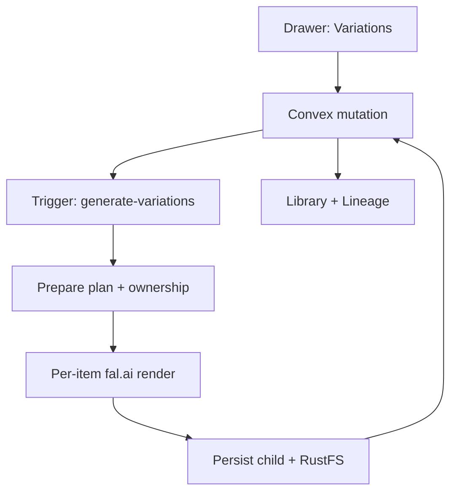

# AI generation

Pindeck generates **child images** from library originals using fal.ai, with optional VLM analysis via OpenRouter. Runs are orchestrated through **Trigger** on app-vm; progress appears under **Work** in the app top bar.

## In the app

<Steps>
  <Step title="Open an active library image">
    **Gallery** or **Table** → click to open the detail drawer.
  </Step>
  <Step title="Variations tab">
    Choose a mode (e.g. **Action Shot**), framing, and count—not a separate “Generate Variation” button on the tile.
  </Step>
  <Step title="Generate">
    Click **Generate …** to queue work. Watch **Work** for Trigger status.
  </Step>
  <Step title="Lineage">
    New images appear in the library with **VAR** styling; **Lineage** in the drawer shows parent and children.
  </Step>
</Steps>

## Pipeline

| Stage | Responsibility |
| --- | --- |
| **Convex** | Auth, ownership, `parentImageId`, lineage, orchestration leases |
| **Trigger** | Long-running prepare / render / persist callbacks |
| **fal.ai** | Image edit / variation render |
| **OpenRouter VLM** | Smart analysis and metadata backfill (also via table **Backfill metadata**) |

### Variation modes (UI)

Modes are labeled in **Title Case** in the drawer (e.g. Action Shot, Close-Up). Each run creates one or more **child** rows with `sourceType: ai` and a link to the parent.

## Configuration

Set these in the **Convex** project settings:

| Variable | Description |
|----------|-------------|
| `FAL_KEY` | fal.ai API key for image generation |
| `OPENROUTER_API_KEY` | OpenRouter API key for VLM analysis |
| `OPENROUTER_VLM_MODEL` | Optional model override for vision analysis |
| `OPENROUTER_PROVIDER_SORT` | Optional provider sorting preference |

Orchestration toggle: `PINDECK_TRIGGER_ORCHESTRATION_ENABLED` — when `true`, heavy jobs use Trigger (see [Architecture overview](/guides/architecture-overview)).

## Smart analysis HTTP

The `/smartAnalyzeImage` endpoint uses OpenRouter VLM for analysis before or alongside generation. Requires `INGEST_API_KEY` Bearer auth and image ownership checks.

See [Smart Analyze endpoint](/api-reference/endpoint/smart-analyze).

## Variation metadata

| Field | Type | Description |
|-------|------|-------------|
| `parentImageId` | ID | Reference to the source image |
| `variationCount` | number | Number of variations requested |
| `variationType` | string | Mode / shot / style category |
| `variationDetail` | string | Specific variation applied |
| `sourceType` | string | `ai` for generated images |
| `sref` | string (optional) | Style reference propagated from lineage |

## Rate limits and costs

- fal.ai charges per generation — monitor usage in your fal.ai dashboard
- OpenRouter charges per VLM analysis call
- Generation time varies (often tens of seconds per image; **Work** shows live status)

## Related

- [Product workflow](/guides/product-workflow) — step 3 optional branch  
- [Architecture overview](/guides/architecture-overview) — sequence diagram for variations  
- [Trigger orchestration (repo)](https://github.com/gordo-v1su4/pindeck/blob/main/docs/trigger-orchestration.md) — task names and queues
