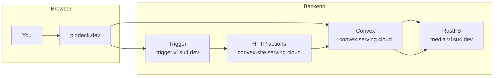
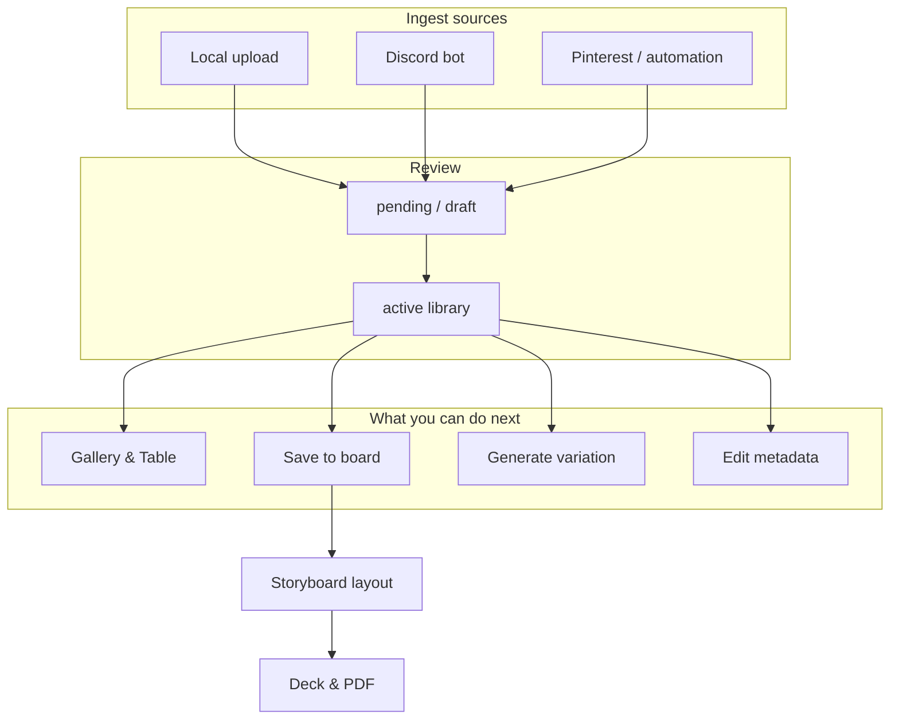
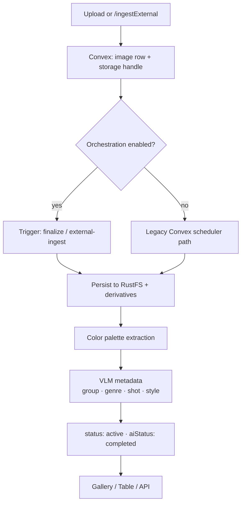
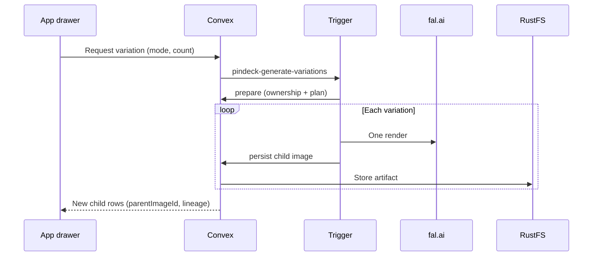
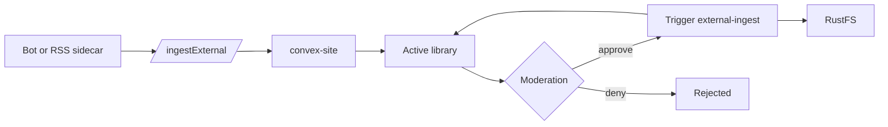

# Architecture overview

Pindeck splits **what you click** (React on Vercel) from **what runs in the background** (Convex, Trigger on app-vm, RustFS media). This page is for anyone who wants the backend story without reading the whole repo.

<Info>
Deep ops detail lives in the GitHub repo: [platform topology](https://github.com/gordo-v1su4/pindeck/blob/main/docs/architecture/platform-topology.md) and [Trigger orchestration](https://github.com/gordo-v1su4/pindeck/blob/main/docs/trigger-orchestration.md).
</Info>

## Production map

| Layer | Role |
| --- | --- |
| **Frontend** | Gallery, boards, decks, upload UI; real-time Convex subscriptions |
| **Convex** | Image records, auth, boards/decks, orchestration state, HTTP ingest |
| **Trigger** | Long jobs: finalize upload, derivatives, VLM metadata, fal.ai variations |
| **RustFS** | Durable originals + preview / webp derivatives |

---

## After an image arrives

Every path ends in the same **library image** row, but entry differs:

<Note>
**Decks need boards.** Board → storyboard → **Convert to Deck** copies image references into slides. Skipping the board step leaves nothing for the deck strip to show.
</Note>

---

## Backend pipeline (one new image)

What happens while you wait for an upload or ingest to appear in **Gallery**:

| Stage | What changes |
| --- | --- |
| **Store** | Original and sized previews land under `pindeck/media-uploads/…` on RustFS |
| **Tag / describe** | OpenRouter VLM fills cinematic fields; you can edit in the drawer or table |
| **Palette** | Dominant colors in `images.colors` (gallery swatches, table column, deck composer) |
| **Display** | Active images join the shared library query; filters and aggregations update live |

---

## AI variation (optional branch)

Watch **Work** in the top bar for run progress. Children stay linked to the parent for **Lineage** in the drawer.

---

## External ingest (Discord / Pinterest)

See [Discord bot](/guides/discord-bot) and [Uploading](/guides/uploading).

---

## Related

- [Product workflow](/guides/product-workflow) — numbered steps in the UI  
- [Uploading](/guides/uploading) — tabs, fields, storage paths  
- [AI generation](/guides/ai-generation) — variation modes and env keys  
- [Development](/development) — local build and deploy
