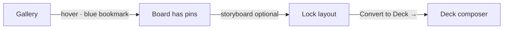

# Boards

Boards are **collections of library images** (pins). They are the required middle step before a deck: decks pull slide images from boards that already contain pins.

<Warning>
**Start in Gallery, not Boards.** You cannot fill a board from the Boards screen alone. In **Gallery**, hover a tile and use the **blue bookmark** (**Save to board**) on each image you want. Only after those pins exist on a board can you open **Boards** and later **Convert to Deck →**.
</Warning>

## Order: bookmark first, deck second

| Step | Where | Action |
| --- | --- | --- |
| 1 | **Gallery** | Hover tile → **Save to board** (bookmark turns blue when saved) |
| 2 | **Boards** | Open board → storyboard / **Lock Board** (optional) |
| 3 | **Boards** or board **Decks** tab | **Convert to Deck →** |
| 4 | **Decks** | Open composer → Present / PDF |

## Create a board from the gallery

<Steps>
  <Step title="Open Gallery">
    Sidebar **Gallery** (`G`). Images must be **active** in the library (after upload/ingest).
  </Step>
  <Step title="Save to board (blue bookmark)">
    Hover a tile. Top-right **bookmark** → **Save to board**. Pick a board or **Create New Board**. The bookmark fills **blue** when that image is on at least one board.
  </Step>
  <Step title="Create or pick a board">
    Choose an existing board or **Create New Board** (name, optional description, public/private).
  </Step>
  <Step title="Add more pins">
    Repeat until the board has the set you want (often 10–12 references for a deck).
  </Step>
</Steps>

Guest sessions see an empty or non-persistent boards experience—**sign in with email** to keep collections.

## Open a board and storyboard

1. Sidebar **Boards** (`B`).
2. **Double-click** a board card (tooltip: “Double-click to open …”) or press Enter/Space when focused.
3. The **Board** tab shows:
   - **Shots** — draggable thumbnails from the board.
   - **Storyboard** — frames with Grid / Hero / Strip layouts and slot grids.

### Storyboard actions

| Action | What it does |
| --- | --- |
| Drag shot → slot | Places that library image in a frame cell. |
| Style / grid size chips | Changes layout density per frame. |
| **Add** | Adds another storyboard frame. |
| **Lock Board** | Saves layout to Convex for this board (shows Locked when saved). |

There is no separate “convert to storyboard” button—the storyboard **is** the board detail view on the **Board** tab.

## Decks tab on a board

Switch to **Decks** inside an open board to see decks created from this board, or **Convert to Deck →** when the board has at least one pin.

## Board data (reference)

| Field | Description |
| --- | --- |
| `name` | Board title |
| `description` | Optional subtitle |
| `isPublic` | Public vs private visibility |
| `imageIds` | Ordered list of library image IDs |

See [Decks](/guides/decks) for the composer, present mode, and PDF export.
