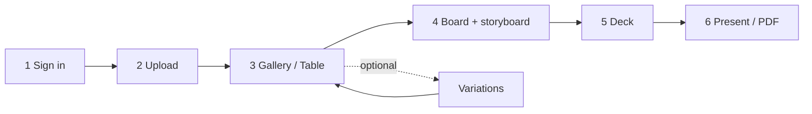
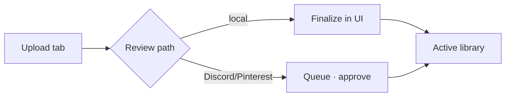

# Product workflow

Use this page when you are clicking through [pindeck.dev](https://www.pindeck.dev) and want to know **what step comes next** and **what each step is for**. For backend diagrams (storage, tagging, Trigger), see **[Architecture overview](/guides/architecture-overview)**.

<Warning>
**Sign in with email** (not guest) if you need boards, decks, or storyboards to persist. Guest can browse the library, but boards and saved decks do not sync to your account.
</Warning>

## Pipeline at a glance

| Step | Where in the app | What it does |
| --- | --- | --- |
| 1 | Sign-in | Authenticates you to Convex; required for owned uploads, boards, and decks. |
| 2 | **Upload** (or ingest) | Brings new images into the library (pending → review → active). |
| 3 | **Gallery** / **Table** | Browse, filter, open detail, metadata, palette, variations. |
| 4 | **Boards** | Collections of library images; storyboard layout lives here. |
| 5 | **Decks** | Slide presentations built **from a board that already has images**. |
| 6 | Deck composer | Arrange slides, present, export PDF. |

<Note>
An empty **Decks** gallery usually means you have **no deck yet**, not that the app is broken. Decks get slide images from a **board**. Build the board first (step 4), then **Convert to Deck** (step 5).
</Note>

---

## Step 1 — Sign in

<Steps>
  <Step title="Open the app">
    Go to [www.pindeck.dev](https://www.pindeck.dev).
  </Step>
  <Step title="Use email sign-in">
    Enter email and password, then **Sign in**. Avoid **Continue as guest** when testing boards, decks, or uploads you need to keep.
  </Step>
  <Step title="Confirm the shell loaded">
    You should see the sidebar (Gallery, Table, Boards, Decks, Upload), search, and library content—not a blank main area after sign-in.
  </Step>
</Steps>

**What this step does:** Connects the UI to your Convex user so mutations (boards, uploads, generation) run as you—not an anonymous guest session.

---

## Step 2 — Get images into the library

<Steps>
  <Step title="Open Upload">
    Sidebar **Upload** (`U`) or top bar **Upload**.
  </Step>
  <Step title="Choose a source tab">
    - **Local Upload** — pick or drag files (PNG, JPG, GIF, SVG; size limits on the drop zone).  
    - **Discord** / **Pinterest** / **Automation** — queue and approve imports (see [Uploading](/guides/uploading)).
  </Step>
  <Step title="Review and finalize">
    Follow on-screen states until the image is **active** in the library. Background **Trigger** workers finalize media to RustFS and run analysis when orchestration is enabled.
  </Step>
</Steps>

**What this step does:** Creates `images` rows and durable media. Until an image is **active**, bookmark-to-board and variations are limited.

---

## Step 3 — Gallery and image detail

<Steps>
  <Step title="Gallery or Table">
    **Gallery** (`G`) for tiles; **Table** (`T`) for sortable rows, bulk actions, and palette tools.
  </Step>
  <Step title="Open an image">
    Click a tile (or row) to open the **detail drawer**: hero, **Edit**, **Variations**, **Lineage**.
  </Step>
  <Step title="Check metadata and palette">
    After analysis, Type / Genre / Shot / Style and **tags** appear in Edit and in the table. Palette swatches come from `images.colors`.
  </Step>
  <Step title="Generate a variation (optional)">
    **Variations** tab → pick mode (e.g. Action Shot), framing, count → **Generate …**. Watch **Work** in the top bar for Trigger progress.
  </Step>
</Steps>

**What this step does:** Validates ingest and optional AI on real assets. Variations stay linked to the parent (`parentImageId`).

---

## Step 4 — Build a board (required before decks)

<Warning>
**Do this in Gallery first.** Use the **blue bookmark** (**Save to board**) on gallery tiles. You are not adding images to a board from the empty **Boards** list—you bookmark from **Gallery**, then open **Boards** to lay out or convert.
</Warning>

<Steps>
  <Step title="Open Gallery">
    Sidebar **Gallery** (`G`).
  </Step>
  <Step title="Save images to a board">
    Hover a tile → **Save to board** (bookmark icon, fills **blue** when the image is on a board). Add to an existing board or **Create New Board**.
  </Step>
  <Step title="Add enough pins">
    Aim for roughly **10–12 images** (or any set you want on a deck). Empty boards cannot become decks.
  </Step>
  <Step title="Open Boards">
    Sidebar **Boards** (`B`). You should see collections and pin counts.
  </Step>
  <Step title="Open the storyboard workspace">
    **Double-click** a board card. The **Board** tab shows **Shots** + **Storyboard** frames.
  </Step>
  <Step title="Lay out and lock">
    Drag thumbnails into slots; adjust Grid / Hero / Strip. **Lock Board** saves layout to Convex.
  </Step>
</Steps>

**What this step does:** A board is an ordered set of library image IDs. The storyboard is the visual arrangement; locking persists per board.

---

## Step 5 — Create a deck from the board

<Steps>
  <Step title="Convert">
    On a board card or inside the board **Decks** tab → **Convert to Deck →** (requires at least one pin).
  </Step>
  <Step title="Open Decks">
    Sidebar **Decks** (`D`). Deck cards show strip previews from board images.
  </Step>
  <Step title="Open the composer">
    Click a deck to edit slides, blocks, palette, and **Present**.
  </Step>
</Steps>

**What this step does:** Copies board image references into deck slides. Skipping step 4 leaves the composer without imagery.

---

## Step 6 — Present and export

<Steps>
  <Step title="Edit in composer">
    Reorder slides, edit blocks, typography, scroll FX; changes autosave to Convex.
  </Step>
  <Step title="Present">
    **Present** for fullscreen preview.
  </Step>
  <Step title="Export PDF">
    **PDF** exports slides client-side.
  </Step>
</Steps>

---

## Related guides

- [Architecture overview](/guides/architecture-overview) — backend mermaid flows  
- [Uploading](/guides/uploading) — tabs, metadata, RustFS paths  
- [Boards](/guides/boards) · [Decks](/guides/decks) · [AI generation](/guides/ai-generation)
