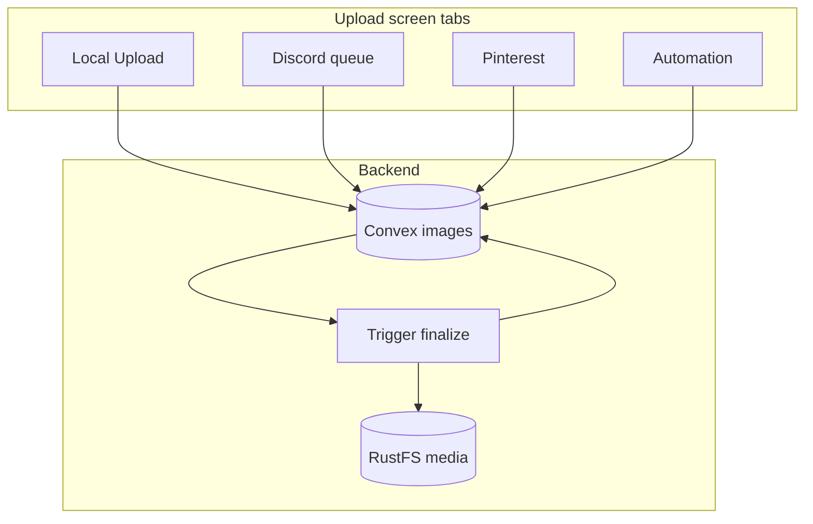
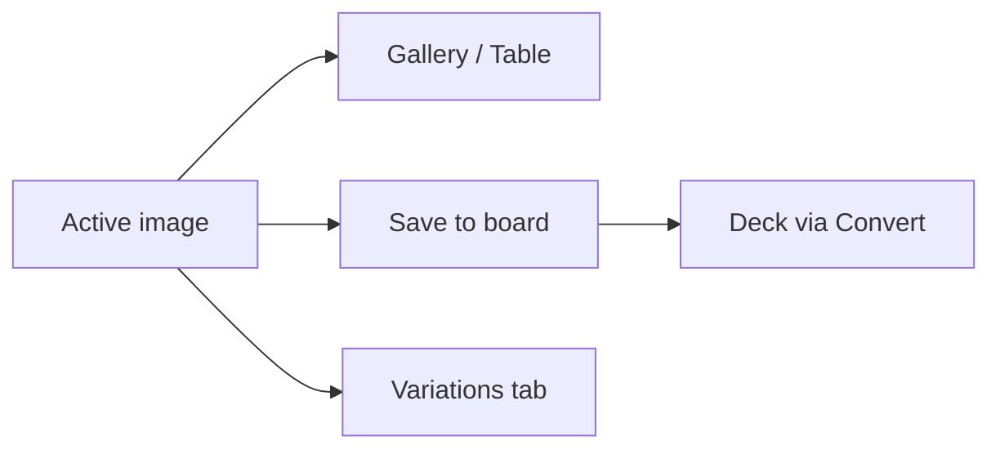

# Uploading images

Images enter Pindeck through **Upload** in the app (sidebar `U` or top bar). Every source converges on the same library record and storage path.

## Ingest paths



| Tab | What you do | Notes |
| --- | --- | --- |
| **Local Upload** | Drag or pick files on the drop zone | Review/finalize in UI until **Gallery** shows the image |
| **Discord** | Review queued imports | Approve/deny before full pipeline ([Discord bot](/guides/discord-bot)) |
| **Pinterest** | Import from boards / RSS | Same metadata and storage as other sources |
| **Automation** | Agent or scripted ingest | Uses HTTP ingest with API key |

For step order in the product, see [Product workflow](/guides/product-workflow). For the full backend diagram, see [Architecture overview](/guides/architecture-overview).

## What happens after upload

1. Convex stores the upload handle and creates an **images** row.
2. **Trigger** (when enabled) runs **finalize upload**: persist to RustFS, generate preview/webp derivatives.
3. **Palette extraction** fills `images.colors`.
4. **VLM analysis** (OpenRouter) fills group, genre, shot, style, and tags when configured.
5. Status becomes **active** — the image appears in Gallery and Table.

### RustFS object path format

```
pindeck/media-uploads/YYYY/MM_DD/original/<filename>
pindeck/media-uploads/YYYY/MM_DD/preview/<filename>-preview.<ext>
pindeck/media-uploads/YYYY/MM_DD/low/<filename>-w320.webp
pindeck/media-uploads/YYYY/MM_DD/high/<filename>-w768.webp
pindeck/media-uploads/YYYY/MM_DD/high/<filename>-w1280.webp
```

Objects are written through the RustFS media API under the `pindeck` bucket. See [RustFS storage](/guides/rustfs-storage).

## Image metadata

Every image record includes:

| Field | Type | Description |
|-------|------|-------------|
| `title` | string | Display name |
| `description` | string (optional) | Detailed description |
| `category` | string | Classification (Commercial, Film, Moodboard, etc.) |
| `tags` | string[] | Searchable keywords |
| `group` | string (optional) | Project grouping (e.g., Commercial, Spec Music Video) |
| `projectName` | string (optional) | Specific project within a group |
| `projectOrder` | number (optional) | Sort order within a project |
| `moodboardName` | string (optional) | Moodboard or reference name |
| `uniqueId` | string (optional) | Auto-generated or custom unique ID |
| `sourceType` | string | Origin: `upload`, `discord`, `pinterest`, `ai` |
| `colors` | string[] (optional) | Extracted color palette |

## Persistence tracking

Each image tracks its durable storage status:

| Field | Values | Description |
|-------|--------|-------------|
| `storageProvider` | `convex`, `rustfs` | Where the file is currently stored |
| `storageBucket` | string | RustFS bucket name |
| `storagePersistStatus` | `pending`, `succeeded`, `failed` | Current persistence state |
| `storagePersistError` | string | Error message if persist failed |
| `derivativeUrls` | object | URLs for small/medium/large derivatives |

## Backfill failed uploads

Reschedule persistence for uploads stuck in Convex storage:

```bash
bun run deploy:convex
```

This targets images where `sourceType = "upload"`, `storageProvider = "convex"`, and `storageId` is still present.

## Sources

- **Direct upload** — **Upload** → **Local Upload** tab
- **Discord** — Bot emoji / commands → review queue ([Discord bot](/guides/discord-bot))
- **Pinterest** — Import tab or RSS sidecar
- **AI** — Variations from the image drawer ([AI generation](/guides/ai-generation))

## Next steps in the app


