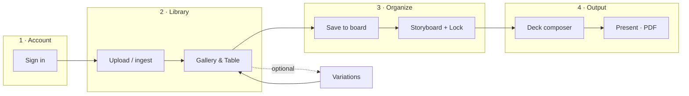
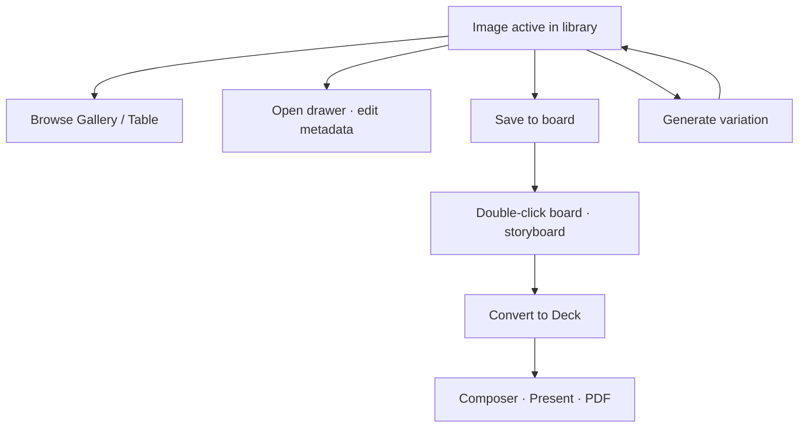

# Pindeck Docs

Pindeck is the operating surface for ingesting, organizing, generating, and presenting visual references. These docs match the production app at [pindeck.dev](https://pindeck.dev). Open **Docs** from the app top bar to sync your Tweaks accent on [docs.pindeck.dev](https://docs.pindeck.dev).

## How work flows through the app

<Warning>
Use **email sign-in** (not guest) when you need boards, decks, and uploads to persist. **Decks need boards, and boards need Gallery bookmarks:** hover tiles → blue **Save to board** → then **Convert to Deck →**. An empty **Decks** gallery usually means that bookmark step was skipped.
</Warning>

<CardGroup cols={2}>
  <Card title="Product workflow" icon="route" href="/guides/product-workflow">
    Six steps: what each screen does and in what order.
  </Card>
  <Card title="Architecture overview" icon="sitemap" href="/guides/architecture-overview">
    Mermaid maps for ingest, storage, tagging, and Trigger jobs.
  </Card>
  <Card title="Quickstart" icon="rocket" href="/quickstart">
    First session on pindeck.dev in under fifteen minutes.
  </Card>
  <Card title="Upload and review" icon="upload" href="/guides/uploading">
    Local, Discord, Pinterest — into the same library path.
  </Card>
  <Card title="Boards & storyboards" icon="layer-group" href="/guides/boards">
    Bookmark pins, double-click a board, drag shots, lock layout.
  </Card>
  <Card title="Decks" icon="presentation" href="/guides/decks">
    From board to composer, Present mode, and PDF export.
  </Card>
  <Card title="AI variations" icon="sparkles" href="/guides/ai-generation">
    Drawer **Variations** tab, fal.ai, and **Work** activity.
  </Card>
  <Card title="Development" icon="terminal" href="/development">
    Local build, env, Convex deploy, and docs publishing.
  </Card>
</CardGroup>

## After upload — your options

## Production surfaces

| Surface | Location |
| --- | --- |
| App | [pindeck.dev](https://pindeck.dev) |
| Docs | [docs.pindeck.dev](https://docs.pindeck.dev) (Mintlify, `docs/` in repo) |
| Convex + HTTP | `convex.serving.cloud` / `convex-site.serving.cloud` |
| Trigger workers | [trigger.v1su4.dev](https://trigger.v1su4.dev) |
| Media | [media.v1su4.dev](https://media.v1su4.dev) |

## Start here

1. [Product workflow](/guides/product-workflow) — manual QA checklist in the live app  
2. [Architecture overview](/guides/architecture-overview) — backend path in diagrams  
3. [API reference](/api-reference/introduction) — Convex HTTP endpoints
