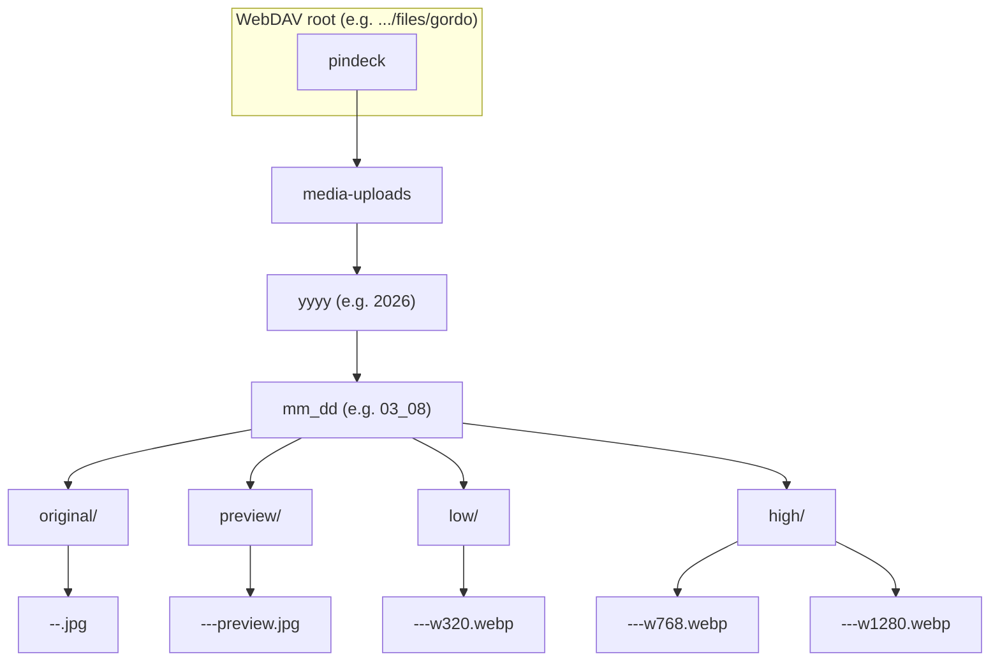

# PinDeck WebDAV Uploads (Convex -> Nextcloud)

This document defines the canonical WebDAV setup for PinDeck media uploads.

## Scope

- Storage target: Nextcloud WebDAV
- Project prefix: `pindeck`
- Media folder prefix: `pindeck/media-uploads`
- Naming rule: no spaces, use kebab-case for folder names

## Canonical URLs

Base WebDAV root for user `gordo`:

```text
https://cloud.v1su4.dev/remote.php/dav/files/gordo
```

Project media prefix:

```text
pindeck/media-uploads
```

Example full file URL:

```text
https://cloud.v1su4.dev/remote.php/dav/files/gordo/pindeck/media-uploads/2026/03/clip-001.mp4
```

## Convex Environment Variables

Set these values in the Convex project:

```bash
NEXTCLOUD_WEBDAV_BASE_URL=https://cloud.v1su4.dev/remote.php/dav/files/gordo
NEXTCLOUD_WEBDAV_USER=gordo
NEXTCLOUD_WEBDAV_APP_PASSWORD=<nextcloud-app-password>
NEXTCLOUD_UPLOAD_PREFIX=pindeck/media-uploads
```

Use a Nextcloud app password (not the main account password).

## Folder Creation Behavior

WebDAV does not create nested folders automatically from a `PUT` path.
Convex must create the directory structure before upload.

Required folder creation order:

1. `pindeck`
2. `pindeck/media-uploads`
3. `pindeck/media-uploads/<yyyy>`
4. `pindeck/media-uploads/<yyyy>/<mm>`

Then upload with `PUT` to:

```text
pindeck/media-uploads/<yyyy>/<mm_dd>/<folder>/<file-name>
```

## Recommended Media Organization

- Year/month partition: `/<yyyy>/<mm>/`
- File names: kebab-case only
- Example: `2026-03-05-customer-demo-01.mp4`

## Minimal WebDAV Method Contract

- `MKCOL` for each missing folder
- `PUT` for file upload
- `PROPFIND` optional, for existence checks and listing

If `MKCOL` returns "already exists", treat that as success and continue.

---

## Nextcloud media folder structure (backend)

All persisted images (uploads and AI-generated) go under the upload prefix, organized by **year/month_day**. Each image has:

- **Full/original** — same resolution and format as uploaded or generated (e.g. PNG, JPG, WebP).
- **Preview (low-res)** — JPEG, max width 800px, stored in a `preview/` subfolder under the same year/month.
- **Low derivative** — WebP around 320px width in a `low/` subfolder.
- **High derivatives** — WebP variants in a `high/` subfolder.

Naming:

- Original: `{uploadPrefix}/{yyyy}/{mm_dd}/original/{title-slug}-{timestamp36}-{nonce}.{ext}`
- Preview: `{uploadPrefix}/{yyyy}/{mm_dd}/preview/{title-slug}-{timestamp36}-{nonce}-preview.jpg`
- Low: `{uploadPrefix}/{yyyy}/{mm_dd}/low/{title-slug}-{timestamp36}-{nonce}-w320.webp`
- High: `{uploadPrefix}/{yyyy}/{mm_dd}/high/{title-slug}-{timestamp36}-{nonce}-w768.webp` and `...-w1280.webp`

`title-slug` is kebab-case from the image title (or filename); `timestamp36` and `nonce` make the path unique.

### Mermaid diagram



### ASCII layout

```text
pindeck/
└── media-uploads/                    # NEXTCLOUD_UPLOAD_PREFIX
    └── 2026/
        └── 03_08/
            ├── original/
            │   ├── my-title-m3abc12-xyz.jpg
            │   └── another-one-m3def34-abc.png
            ├── preview/
            │   ├── my-title-m3abc12-xyz-preview.webp
            │   └── another-one-m3def34-abc-preview.webp
            ├── low/
            │   └── my-title-m3abc12-xyz-w320.webp
            └── high/
                ├── my-title-m3abc12-xyz-w768.webp
                └── my-title-m3abc12-xyz-w1280.webp
```

### Summary

| Item        | Location pattern                                                                 | Format / resolution      |
|------------|-----------------------------------------------------------------------------------|--------------------------|
| Original   | `{prefix}/{yyyy}/{mm_dd}/original/{slug}-{ts}-{nonce}.{ext}`                      | As uploaded/generated    |
| Preview    | `{prefix}/{yyyy}/{mm_dd}/preview/{slug}-{ts}-{nonce}-preview.webp`                | WebP, max 640x640        |
| Low        | `{prefix}/{yyyy}/{mm_dd}/low/{slug}-{ts}-{nonce}-w320.webp`                       | WebP, 320px max width    |
| High       | `{prefix}/{yyyy}/{mm_dd}/high/{slug}-{ts}-{nonce}-w768.webp`, `...-w1280.webp`   | WebP, larger derivatives |

Convex stores `storagePath` and `previewStoragePath` on each image document for cleanup on delete.

### Testing persistence (no test files left behind)

To verify Nextcloud env and connectivity, run the self-cleaning test from the project root:

```bash
npx convex run mediaStorage:testNextcloudPersistence "{}"
```

It uploads a small file under `_test/`, verifies it with a GET, then deletes it. Expect `{ "ok": true }` on success.
