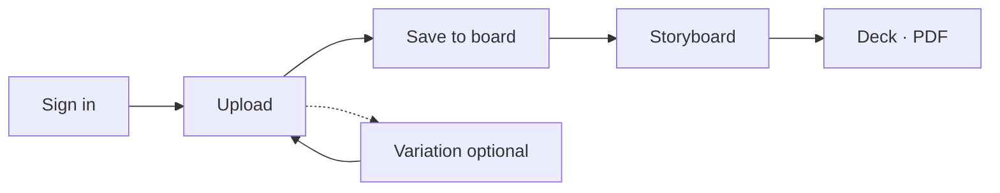

# Quickstart

Follow these steps in order on [www.pindeck.dev](https://www.pindeck.dev). For a full map of every screen, see **[Product workflow](/guides/product-workflow)**. For backend diagrams, see **[Architecture overview](/guides/architecture-overview)**.

<Warning>
Use **email sign-in**, not guest, if you want boards and decks to persist.
</Warning>

## 1. Sign in

1. Open [www.pindeck.dev](https://www.pindeck.dev).
2. Sign in with email and password.
3. Confirm the library shell loads (sidebar + gallery or table)—not an empty black main view.

## 2. Upload an image

1. Sidebar **Upload** (`U`).
2. **Local Upload** tab → click or drag a file onto the drop zone.
3. Complete any review/finalize steps shown in the upload UI until the image appears under **Gallery**.

See [Uploading](/guides/uploading) for Discord, Pinterest, and automation tabs.

## 3. Save to a board (Gallery — blue bookmark)

1. **Gallery** (`G`) — stay on the gallery, not Boards yet.
2. Hover a tile → **Save to board** (top-right bookmark; it turns **blue** when saved).
3. Create a board or add to an existing one.
4. Repeat for every image you want on a future deck (often 10–12 references).

You cannot skip this and go straight to **Decks** with slide images—the deck is built **from a board that already has these pins**.

## 4. Generate a variation (optional)

1. Open the image drawer → **Variations**.
2. Choose a mode (e.g. **Action Shot**) and options → **Generate …**
3. Watch **Work** in the top bar for Trigger progress.

## 5. Storyboard and deck

1. **Boards** → **double-click** your board to open the storyboard workspace.
2. Drag shots into frames; **Lock Board** when the layout is set.
3. **Convert to Deck →** on the board card or **Decks** tab inside the board.
4. **Decks** → open the deck → edit, **Present**, or **PDF** export.

## What's next?

- [Product workflow](/guides/product-workflow) — what each step is for  
- [Boards](/guides/boards) · [Decks](/guides/decks) · [AI generation](/guides/ai-generation)
